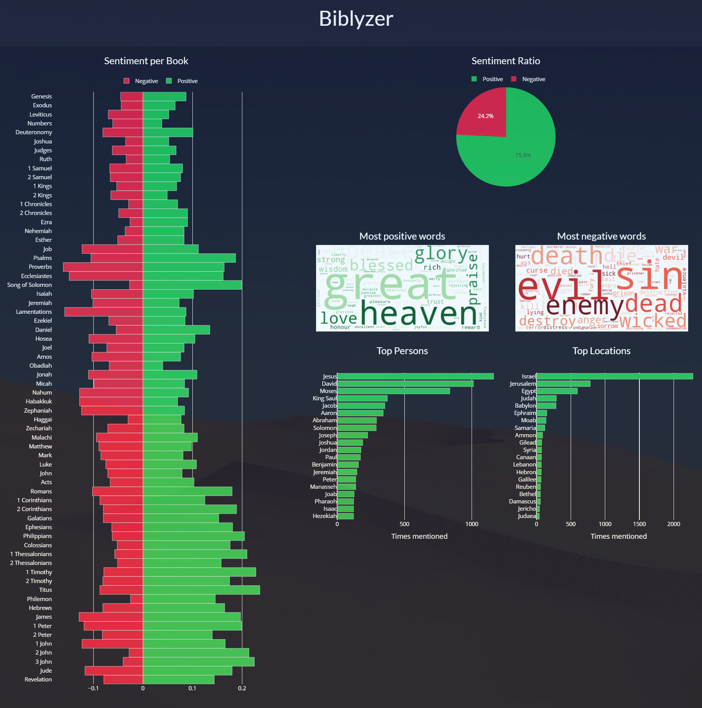

# Biblyzer

## Introduction
As a text mining project, I have made use of NLP techniques - namely Sentiment Analysis and Named Entity Recognition - to help give an overview of the sentiment and entities of the Bible. The data used is the King James Version of the Bible, which I obtained from [Kaggle](https://www.kaggle.com/phyred23/bibleverses).

## Screenshot


## Built With
* [Dash](https://dash.plot.ly/) - Main server and layout
* [Plotly Python](https://plot.ly/python/) - Used to create the interactive plots

## Requirements
To install all of the required packages, simply run:

```
pip install -r requirements.txt
```

and all of the required `pip` packages will be installed, so that the app is able to run.

## How to use this app

Run this app locally by:
```
python biblyzer.py
```
Open http://localhost:8058/ in your browser, and you will see the dashboard.


## What does this dashboard show
This dashboard visualizes the ratio of positive/negative sentiment of each book in the Bible, the sentiment ratio as a whole, as well as the most negative and positive words used throughout the Bible. It also visualized the most mentioned persons and locations in the Bible.

